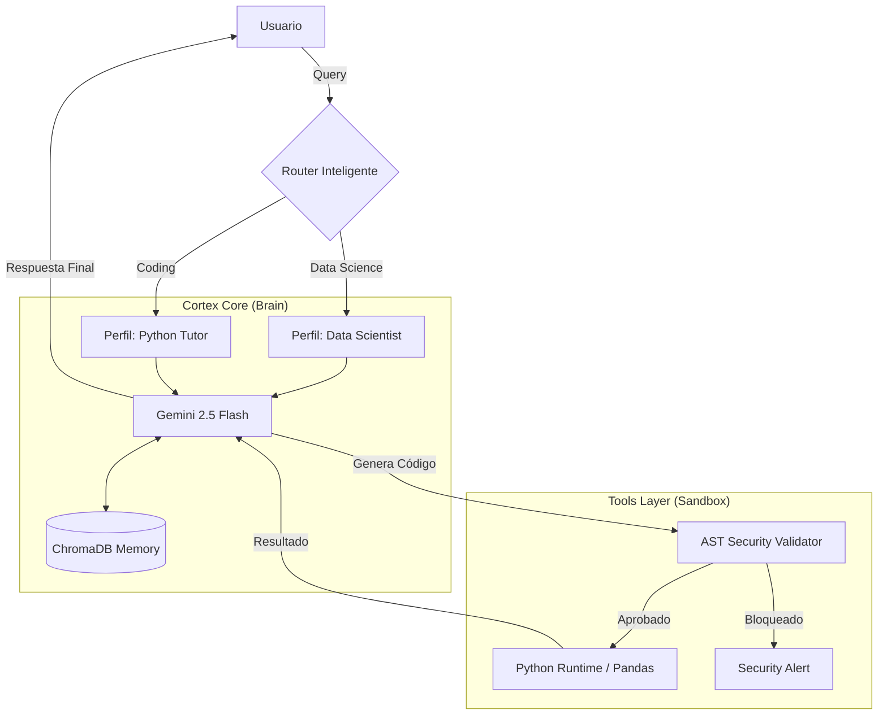

# 🌌 AUTONOMOUS AGENTIC SYSTEM

> **⚠️ Nota:** Este repositorio es un **Portfolio Técnico** y demostración de arquitectura. El código fuente del núcleo (`core/`) se mantiene privado por razones de propiedad intelectual. Este documento detalla la arquitectura, capacidades y flujo de trabajo del sistema.

---

## 🤖 Visión General

No es un simple chatbot; es un **Sistema Agéntico Autónomo** diseñado para razonar, planificar y ejecutar tareas complejas de ingeniería de datos y programación. 

A diferencia de los LLMs tradicionales que solo generan texto, posee un **bucle de ejecución ReAct (Reason + Act)** que le permite:
1.  **Escribir y ejecutar código Python** en un entorno controlado (Sandbox).
2.  **Analizar Datasets** (CSV) y generar estadísticas reales.
3.  **Aprender** de documentos locales (RAG) para adquirir nuevo conocimiento técnico.
4.  **Recordar** experiencias pasadas mediante memoria vectorial persistente.

Todo esto envuelto en una interfaz gráfica con estética **Synthwave/Cyberpunk**, diseñada para una experiencia de usuario inmersiva.

---

## 📸 Demo & Visuales

### 1. El Tablero de Control (UI)
*Interfaz desarrollada en Streamlit con inyección de CSS personalizado para estética "Miami Nights", audio reactivo y gestión de archivos.*

### 2. El "Pensamiento" del Agente (CLI)
*Visualización del proceso de razonamiento interno, uso de herramientas y validación de seguridad en tiempo real.*

---

## 🛠️ Arquitectura del Sistema

El sistema sigue una arquitectura modular desacoplada, separando la lógica de negocio (Backend) de la presentación (Frontend).

## 🧬 Ejemplo de Flujo de Razonamiento (Trace)
A continuación, un extracto real del log de auditoría que muestra cómo el Sistema Agentico resuelve un problema:

Usuario: "Lee el documento adjunto y resuelve el ejercicio 1 en python, se debe incluir ejemplo de uso."

## 💻 Tech Stack
Lenguaje: Python 3.10+

LLM: Google Gemini 2.5 Flash

Frontend: Streamlit (Custom CSS/JS Injection)

Vector DB: ChromaDB (Persistente)

Data: Pandas, NumPy

CLI Visuals: Rich Library

Contacto
Desarrollado por Leandro Guiñazu. Ingeniería de IA & Desarrollo de Sistemas Agénticos.
